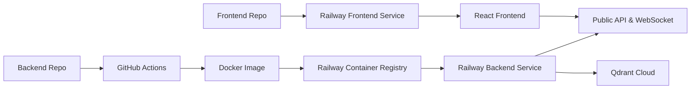

# 🚄 RailMind - Project Overview

> AI-Powered Railway Conflict Detection & Resolution System for Italy's Lombardy Rail Network

[](https://www.python.org/downloads/)
[](https://reactjs.org/)
[](https://fastapi.tiangolo.com/)

---

## 🌐 Platform Link

Live Demo: [https://rail-mind-production.up.railway.app/](https://rail-mind-production.up.railway.app/)

---

## 🎯 Project Overview & Objectives

**RailMind** is an AI-powered platform for railway conflict detection and resolution, designed for Italy's Lombardy rail network. The system leverages machine learning, quantum optimization, and real-time simulation to:

- Predict and detect operational conflicts before they occur
- Recommend optimal resolutions using hybrid mathematical and LLM agents
- Archive and retrieve historical incidents and resolutions for explainable AI
- Provide a live dashboard for monitoring and feedback

---

## 🏗️ Project Hierarchy & Architecture

### Overall Architecture


### Technical Architecture


### High-Level Flow


---

### Project Structure

```
rail-mind/
├── agents/
│   ├── detection-agent/
│   ├── resolution-agent/
│   └── simulator-agent/
├── backend/integration/
├── data-preprocessing/
├── creating-context/
└── frontend/
```

---

## 🛠️ Technologies Used

- **Python** 3.9+
- **React** 18.3+
- **FastAPI** 0.104+
- **Qdrant** (vector database, cloud/local)
- **SentenceTransformer** (all-MiniLM-L6-v2)
- **XGBoost** (ML prediction)
- **NetworkX** (graph building)
- **Groq API** (LLM agent)
- **Ultralytics YOLOv8** (vision-based detection)
- **TypeScript** (frontend)
- **TailwindCSS** (frontend styling)

---

### 1. Detection Agent


**Components:**

- **ML Prediction**: XGBoost (87% AUROC, 72 features, StandardScaler, <10ms inference)
- **Rule Engine**: 17 deterministic safety rules (capacity, headway, deadlock, cascade)
- **Vector Memory**: Qdrant similarity search (384D embeddings, all-MiniLM-L6-v2)
- **Vision Module**: YOLOv8n for track fault detection (640×640, experimental)

**Triggers:** Train arrival/departure, delay threshold, station capacity changes

---

## 🗄️ Qdrant Integration Details

Qdrant is used as a vector database to store and retrieve high-dimensional embeddings for railway incidents, resolutions, and feedback. This enables semantic search and hybrid reasoning in the resolution agent.

**Integration Workflow:**

- Embeddings are generated using SentenceTransformer (all-MiniLM-L6-v2)
- Data (conflicts, resolutions, feedback) is upserted into Qdrant collections (e.g., rail_incidents)
- The resolution agent queries Qdrant for similar historical cases to inform LLM-based hybrid solutions
- Qdrant is accessed via the qdrant-client Python library and REST API

**Benefits:**

- Fast, scalable semantic search for similar cases
- Supports explainable AI by linking new decisions to historical data
- Enables hybrid RAG (Retrieval-Augmented Generation) workflows

**Example Usage:**

```python
from qdrant_client import QdrantClient
from sentence_transformers import SentenceTransformer

model = SentenceTransformer("all-MiniLM-L6-v2")
embedding = model.encode("conflict description").tolist()
client = QdrantClient(url="<QDRANT_URL>", api_key="<QDRANT_API_KEY>")
client.upsert(
    collection_name="rail_incidents",
    points=[{"id": 123, "vector": embedding, "payload": {"conflict_id": "C1"}}]
)
results = client.search(
    collection_name="rail_incidents",
    query_vector=embedding,
    limit=5
)
```

---

### 3. Simulator Agent

**Components:**

- **Physics Engine**: Train positions, velocities, station occupancy, delay propagation
- **State Management**: Track conflicts, signal states, schedule adherence
- **WebSocket**: Real-time broadcast to frontend (configurable update rate)

---


### Pipeline Stages

**1. Preprocessing** (`data-preprocessing-pipeline/`)

- Clean, enrich, calculate delays/times
- Add temporal features (holidays, rush hours)
- Extract resolution types from text
- **Output**: Enriched CSVs/JSONs

**2. Network Graph** (`railway-network-graph/`)

- Build NetworkX graph (50+ stations, 26+ routes)
- Enrich with capacity, distance, utilization
- **Output**: `network_graph.json`

**3. Vector Embedding** (`vector-database/`)

- **Step 1**: Enrich data (GPS, timestamps, resolution extraction)
- **Step 2**: 80/20 time-based train/test split
- **Step 3**: Generate 384D embeddings (sentence-transformers/all-MiniLM-L6-v2)
- **Step 4**: Ingest to Qdrant `rail_incidents` collection (cosine distance)
- **Step 5**: Validation queries and similarity tests
- **Runner**: `run_pipeline.py` (executes all steps sequentially)

**Raw Data:**

- 113 incidents
- 2,975 stations
- 12,173 route segments
- 2.6M train operations

---

## ⚙️ Setup & Installation Instructions

### Installation

```bash
# 1. Clone repo
git clone <repo-url> && cd rail-mind

# 2. Backend setup
python -m venv venv && source venv/bin/activate  # Windows: venv\Scripts\activate
pip install -r backend/requirements.txt
# Key packages: fastapi uvicorn numpy pandas scikit-learn xgboost
#               sentence-transformers qdrant-client networkx groq qiskit ultralytics

# 3. Qdrant setup (choose one)
docker run -p 6333:6333 qdrant/qdrant  # Local
# OR use Qdrant Cloud: https://cloud.qdrant.io/

# 4. Environment variables
echo "OPENROUTER_API_KEY=your-key" > .env
echo "QDRANT_URL=http://localhost:6333" >> .env

# 5. Run data pipeline
cd data-preprocessing/data-preprocessing-pipeline && python preprocess_all_data.py
cd ../railway-network-graph && python run_graph.py
cd ../vector-database && python run_pipeline.py

# 6. Frontend setup
cd frontend && npm install
echo "VITE_API_URL=http://localhost:8002" > .env
```

## 🚦 Usage Examples

### Running the System

```bash
# Terminal 1: Backend
cd backend/integration && python unified_api.py  # Port 8002

# Terminal 2: Frontend
cd frontend && npm run dev

# Terminal 3: Qdrant (if local)
docker run -p 6333:6333 qdrant/qdrant
```

---

## 🚀 Deployment

### Backend: GitHub Actions → Railway (Container Hosting)

- Code is pushed to GitHub; a GitHub Actions workflow builds a Docker image.
- The built image is pushed to Railway's container registry.
- Railway runs the backend service from the latest image, exposing port `8002`.
- Environment variables configured in Railway: `OPENROUTER_API_KEY`, `QDRANT_URL`, optional `PORT`.

Example CI (simplified):

```yaml
name: Backend CI
on:
    push:
        branches: [ main ]
jobs:
    build-and-deploy:
        runs-on: ubuntu-latest
        steps:
            - uses: actions/checkout@v4
            - uses: docker/setup-buildx-action@v3
            - uses: docker/login-action@v3
                with:
                    registry: ${{ secrets.RAILWAY_REGISTRY }}
                    username: ${{ secrets.RAILWAY_USER }}
                    password: ${{ secrets.RAILWAY_TOKEN }}
            - uses: docker/build-push-action@v6
                with:
                    context: .
                    file: ./Dockerfile
                    push: true
                    tags: ${{ secrets.RAILWAY_REGISTRY }}/railmind-backend:latest
```

### Frontend: Railway GitHub Deployment

- The frontend is connected directly to Railway via the GitHub repository.
- Railway builds the app and hosts the static `dist/` output.
- `VITE_API_URL` in Railway env points to the backend public URL (e.g., `https://rail-mind-production.up.railway.app/api`).

### Deployment Architecture



### Notes

- Backend runs as a container with ASGI (`uvicorn`) behind Railway's ingress.
- Frontend served as static assets; ensure CORS and `VITE_API_URL` are correctly set.
- Secrets are managed in Railway; no secrets stored in the repo.

---

## 📦 Requirements & Dependencies

- All dependencies are listed in:
  - backend/requirements.txt (Python backend)
  - frontend/package.json (React frontend)

---

**Base URL**: `http://localhost:8002/api`  
**Docs**: `http://localhost:8002/docs`  
**WebSocket**: `ws://localhost:8002/ws`

### Key Endpoints

```bash
# Simulation
POST /simulation/start
POST /simulation/tick      # Advance 1 minute
GET  /simulation/state

# Detection
POST /api/detect            # Run XGBoost + rules on current state
GET  /api/conflicts         # List active conflicts

# Resolution
POST /api/resolve           # Generate solutions (Math + LLM agents)
POST /api/apply/{action}    # Apply specific resolution action

# Feedback
POST /api/feedback          # Submit rating & comments
GET  /api/feedback/{conflict_id}  # Retrieve feedback

# Vector Search
POST /api/qdrant/search     # Semantic search rail_incidents
```

---

## 👥 TEAM

- **Emna Ouertani** - Project Lead & Deployment
- **Ela Sarhani** - Hybrid-RAG & Integration
- **Nour Mustapha** - Algorithms & Quantum
- **Farah Baraket** - Backend & Data Engineering
- **Asma Raies** - Frontend & Integration

---

## 📚 Documentation

- [README.md](README.md) - Main documentation
- [TECHNICAL_ARCHITECTURE.md](TECHNICAL_ARCHITECTURE.md) - Full tech stack
- [DEPLOYMENT.md](DEPLOYMENT.md) - Railway.com deployment
- [backend/integration/CONFLICT_WORKFLOW.md](backend/integration/CONFLICT_WORKFLOW.md) - Conflict workflow

---

<div align="center">

**Built with ❤️ for safer railway operations**

[GitHub](https://github.com/ouemnaa/rail-mind/)

</div>
